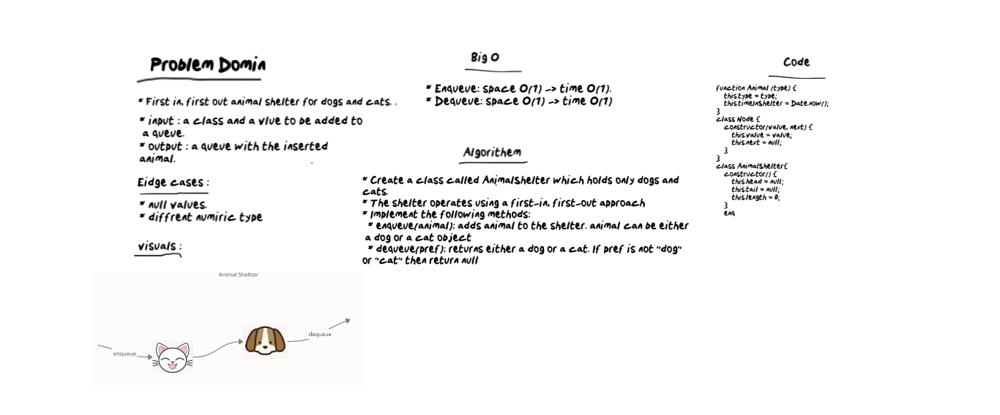

# Stacks and Queues
* First in, first out animal shelter for dogs and cats. . 

# Challenge
* Create a class called AnimalShelter which holds only dogs and cats. 
* The shelter operates using a first-in, first-out approach
* Implement the following methods:
  * enqueue(animal): adds animal to the shelter. animal can be either a dog or a cat object
  * dequeue(pref): returns either a dog or a cat. If pref is not "dog" or "cat" then return null
# Approach & Efficiency
  * Enqueue: space O(1)/time O(1)
  * Dequeue: space O(1)/time O(1)
  
  # whitebored

  