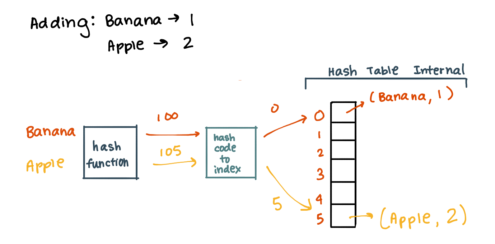

# Hash Table Implementation
* Implement a HashTable and methods.

# Challenge
  * Add: takes in both the key and value. This method should hash the key, and add the key and value pair to the table, handling collisions as needed.
  * Get: takes in the key and returns the value from the table.
  * Contains: takes in the key and returns a boolean, indicating if the key exists in the table already.
  * Hash: takes in an arbitrary key and returns an index in the collection.
# Approach & Efficiency
* O(1) space and time for retriving and adding

  
