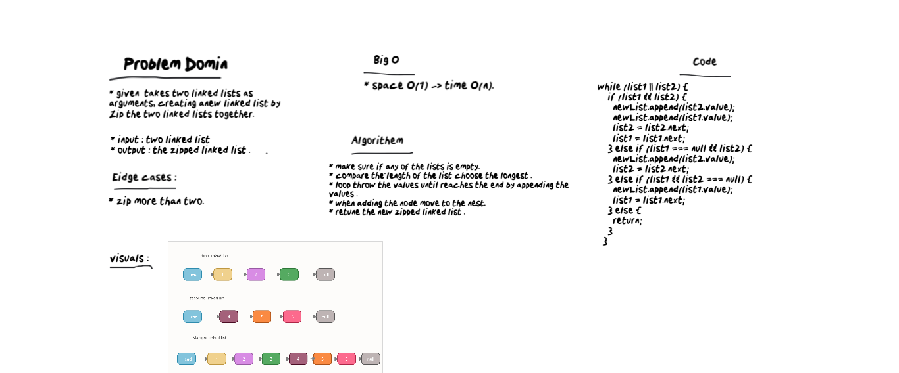

# Linked List - Zip Two lists
* Creating a linked list class that can add nodes, then creating a function that can merge two linked list without sorting them.

## Challenge
* Given two linked list (each one with different length), create a third list by zipping those lists without sorting them.

## Big O:
* For time: O(n)
* For Space: O(1)

## White Board :
 

