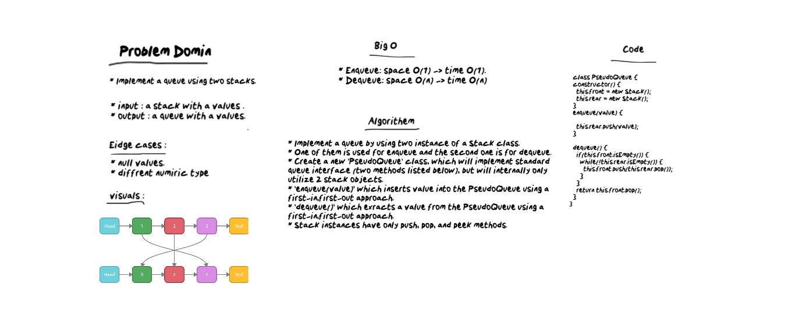

# Stacks with Queues
* Implement a queue using two stacks. 

## Challenge
* Implement a queue by using two instance of a Stack class.
* One of them is used for enqueue and the second one is for dequeue.
* Create a new `PseudoQueue` class, which will implement standard queue interface (two methods listed below), but will internally only utilize 2 stack objects.
* `enqueue(value)` which inserts value into the PseudoQueue using a first-in,first-out approach.
* `dequeue()` which exracts a value from the PseudoQueue using a first-in,first-out approach.
* Stack instances have only push, pop, and peek methods.

## Approach & Efficiency

* Enqueue: space O(1) -> time O(1).
* Dequeue: space O(n) -> time O(n).

## White Board :
 
