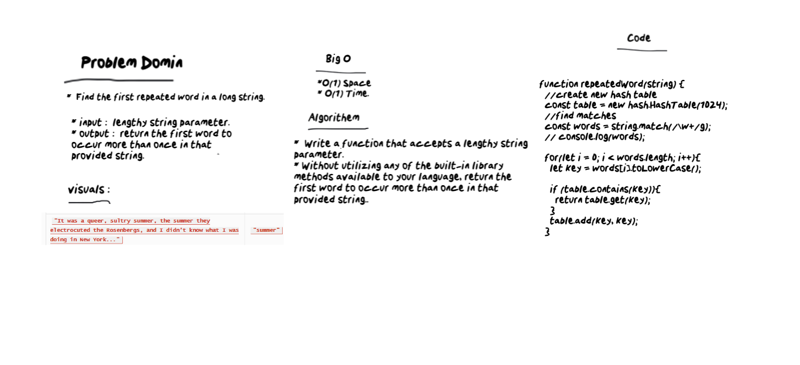

# Repeated Word
* Find the first repeated word in a long string.

# Challenge
* Write a function that accepts a lengthy string parameter.
* Without utilizing any of the built-in library methods available to your language, return the first word to occur more than once in that provided string.

# Approach & Efficiency
* O(1) Space / O(1) Time.

# White Bored

