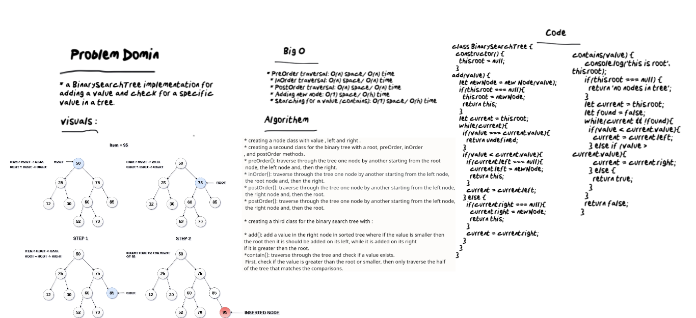
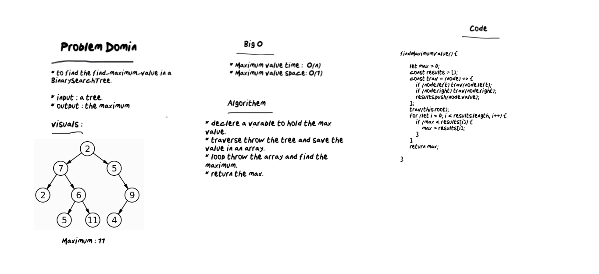
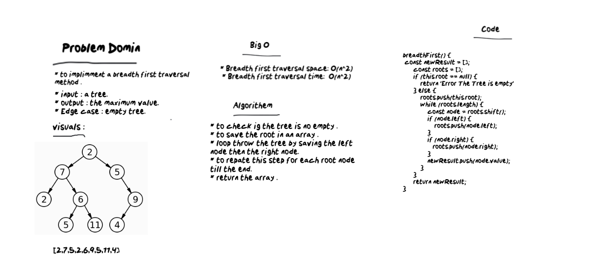

# Multi Bracket Validation

* Binary tree and binary search tree methods and implementation.
# Challenge
* Create three classes:
  * Node class with value, left and, right properties.
  * Binary Tree class with preOrder, inOrder, and postOrder methods.
  * Binary Search Tree with add (adding a value in the right order in a tree) and contain (check if a value     exists) methods.
  * Extend BinaryTree class, write an instance method called find-maximum-value which returns the maximum value stored in the tree.
  * Breadth-First Traversing: It is traversing through the tree line by line from the root node until the leaves nodes.
# Approach & Efficiency
  * PreOrder traversal: O(n) space/ O(n) time
  * InOrder traversal: O(n) space/ O(n) time
  * PostOrder traversal: O(n) space/ O(n) time
  * Adding new node: O(1) space/ O(h) time
  * Searching for a value (contains): O(1) space/ O(h) time
  * Find max value: O(1) space/ O(n) time
  * Breadth first traversal: O(n^2) space/ O(n^2) time

  # whitebored

  

  # whitebored for Max value

  

  # whitebored for Breadth first traversal

  
