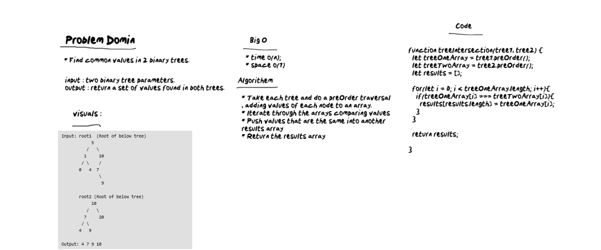

# Tree Intersection
* Find common values in 2 binary trees.

# Challenge
* Write a function called tree_intersection that takes two binary tree parameters
* Without utilizing any of the built-in library methods available to your language, return a set of values found in both trees.

# Approach & Efficiency
* Take each tree and do a preOrder traversal, adding values of each node to an array.
* Iterate through the arrays comparing values
* Push values that are the same into another results array
* Return the results array

# White Bored

