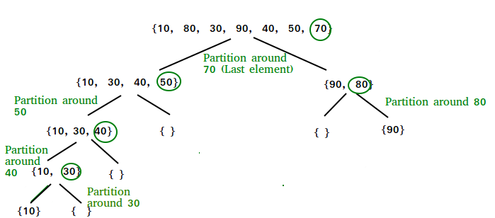

# Quick Sort
* QuickSort algorithm is based on divide and conquer approach. Divides elements into smaller parts based on condition and performing the sort operations on those divided smaller parts.

# Steps
* Step 1: Select an element in the array to be the pivot element (midpoint of array).

* Step 2: Next, compare all array elements with the selected pivot element and arrange them in such a way that, elements less than the pivot element are to it's left and greater than pivot is to it's right.

Step 3: Perform the same operations on left and right side elements to the pivot element.

# Visual
