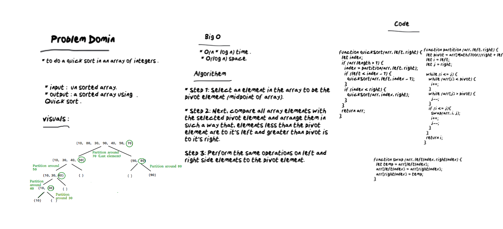

# Quick Sort
* Review the provided pseudocode, then trace the algorithm by stepping through the process with the provided sample array. Document your explanation by creating a blog article that shows the step-by-step output after each iteration through some sort of visual.

# Challenge
* Provide a visual step through for each of the sample arrays based on the provided pseudo code
Convert the pseudo-code into working code in JavaScript , present a complete set of working tests.
# Approach & Efficiency
* go through the algorithm step by step visually and then using the provided pseudocode to implement working code.
O(n * log n) time / O(log n) space

# Big O
 * O(n * log n) time .
 * O(log n) space.

# Whiteboard

